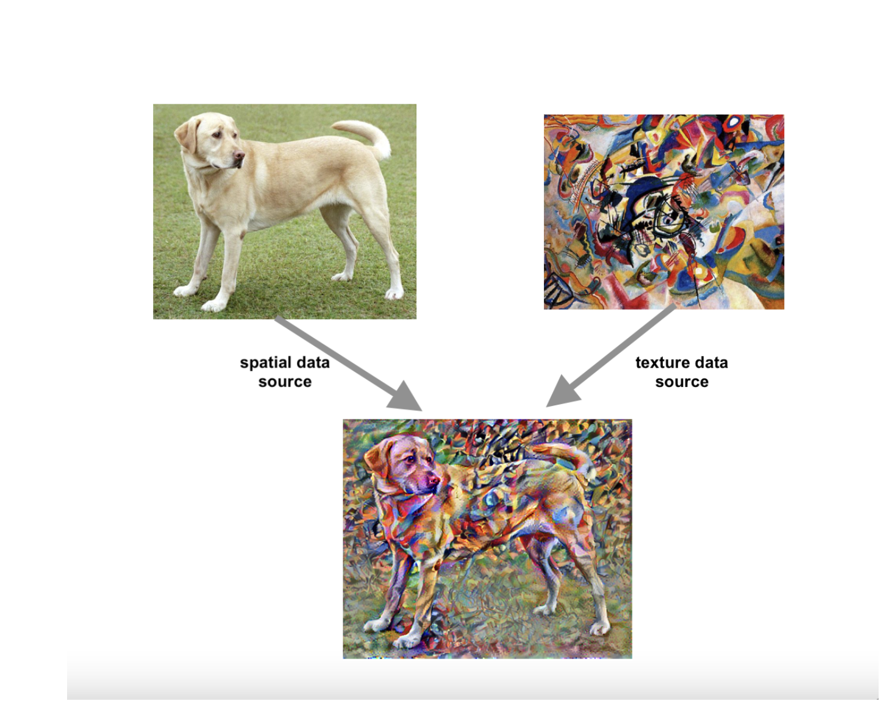
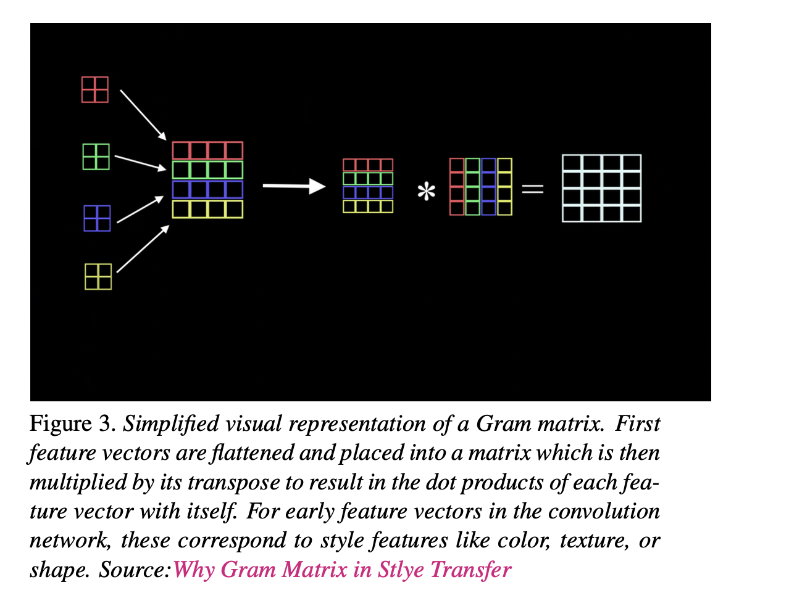
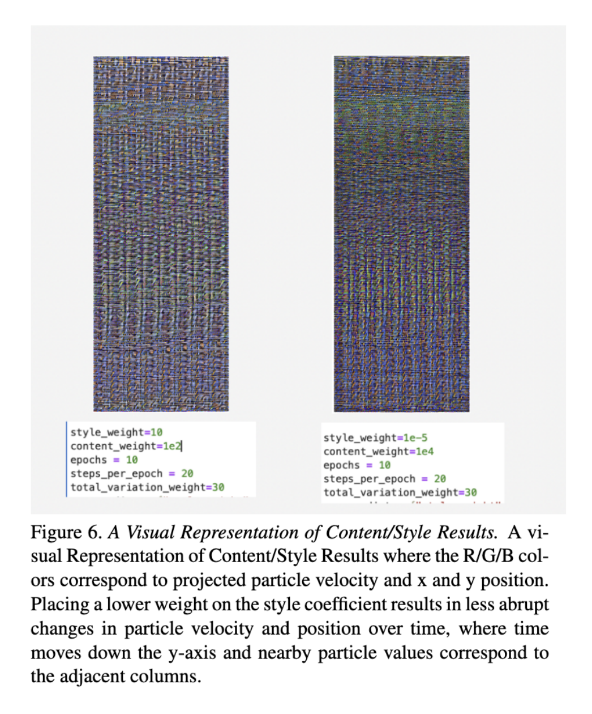
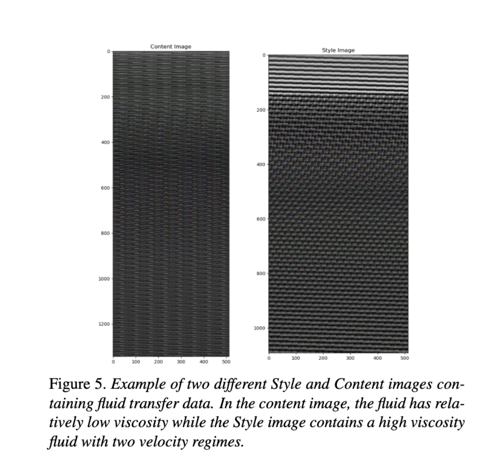

# Physical Meaning of Style Transfer: Physics-Informed Style Transfer for CFD simulations. (Paper Sample)

We propose a potential physical meaning of the use
of the Gram Matrix for style transfer which extends beyond
the notion of texture, shape, and color in images to the relationships between feature vectors in simulations of physical
systems. We incorporate domain knowledge of the use of
CNNs in science applications with a focus on computational
fluid dynamics in the lagrangian regime and suggest that the
learned feature-vector Gram matrix may have physical significance in other domain applications. We propose future
areas of study for style transfer extending beyond the realm
of images and art into the relationship between learned feature vectors for physically-relevent data.

## Style Transfer: An Overview

In style transfer, the machine learns a link between texture and color. For example, one texture often uses a particular color. Style is a correlation between shapes/color distributions, etc. One way to look at style is to consider it the correlation between kernels. The similarity between two kernels can be calculated using a dot product. (The gram matrix is effectively a "similarity matrix", showing the correlation between kernels.)

Convolutional feature maps are generally a good representation of input image’s features. They capture spatial
information of an image without containing the style information given that a feature map is used as it is. Starting from the network’s input layer, the first few layer
activations represent low-level features like textures, colors,
and edges. Proceeding through the network, latter layers
represent higher-level features like shapes, and recognizable
large scale feature artifacts like animals, faces, or objects.
We use the VGG19 network architecture, a pre-trained image classification network and extract intermediate layers to
define the representation of content and style from particle
data.

## SPH Formulation

SPH simulations involve several key steps:

#### Particle Representation
The core is divided into a large number of discrete particles, often referred to as "fluid particles." These particles represent small portions of the mass of the core material and are assigned physical properties based on the initial conditions.
    
#### Initial Conditions 
The simulation starts with either a geometric distribution or a random initialization of fluid particles and relaxes to an equilibrium. Researchers define the initial point properties such as density, temperature, composition, and initial velocity distribution.

#### Equations of Motion
The fundamental equations governing the behavior of the fluid (e.g., the Navier-Stokes Equation) are discretized and solved for each particle within the simulation. The interactions between particles are computed using kernel functions that account for physical properties like pressure, density, and viscosity.
    
#### Time Integration
SPH simulations evolve over time, advancing the system's state each time step. This integration process updates particle positions and velocities, taking into account the forces acting on them.
    
#### Boundary Conditions
Researchers impose boundary conditions to reflect the physical constraints of the system such as spacial boundaries and relational constraints. In our case, the motion of the SPH particles was contained to a unit cube.

### Smooth-Particle Hydrodynamics Density Estimation}

The density $\rho_i$ at the position of particle $i$ is estimated using a kernel function $W$:

$$ \rho_i = \sum_j m_j W(\mathbf{r}_i - \mathbf{r}_j, h)$$

where:

$$\begin{align*}
\rho_i & : \text{Density at particle } i, \\
m_j & : \text{Mass of particle } j, \\
\mathbf{r}_i & : \text{Position of particle } i, \\
\mathbf{r}_j & : \text{Position of particle } j, \\
h & : \text{Smoothing length}, \\
W(\mathbf{r}, h) & : \text{Kernel function}.
\end{align*}$$

## Dataset 

The dataset was obtained through publicly available, pre-
run Lagrangian SPH fluid simulations. For each simula-
tion, the fluid block is set with different initial conditions
like shape, position, velocity, and fluid viscosity. The re-
sults of each simulation are stored as a .npy array file with
4 dimensions inside a folder with the respective simulation
ID, available for public download here: https://inductiva.ai/blog/article/fluid-cube-dataset

## Gram Matrix Calculation 

 The Gram matrix for a particular layer can be calculated as:

$$ G^l_{cd} = \frac{\sum_{ij} F^l_{ijc} (x) F^l_{ijd}}{IJ}$$

The Gram matrix is calculated by taking the outer product of
the feature vector with itself at each location and averaging
that outer product over all locations. the mean square error of the image’s output rela-
tive to each target can be used in gradient descent. Partially
fixed weights at the later convolutional layers in the Content
image preserve the content of the image while the weighted
sum of the losses is used to change the Gram Matrix results
for low-level features.

Image Source: https://www.youtube.com/watch?v=Elxnzxk-AUk

## Resulting Style Images (Sample)

There are many opportunities to expand this work, which
is simply opening the door to the possibility of a physical intuition of Style Transfer for simulation data. Fine-grained
SPH simulations were used such that the particles have only
undergone a few seconds of real-time motion, thus the starting point of the particles is sufficient metric along the x-
axis, preserving some spatial relevance. For longer simulations, this method could pose problems due to the parti-
cles undergoing long-range motion and a better pre-trained
model would be needed to capture the large-scale spatial
features of the data when applying Style Transfer to extract
small-order feature vectors. 

